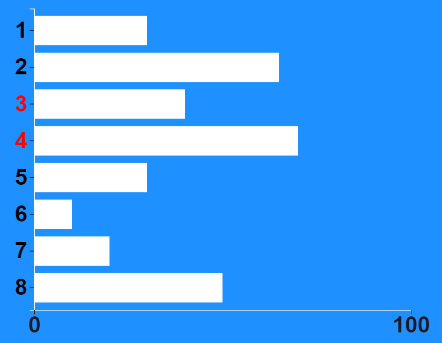
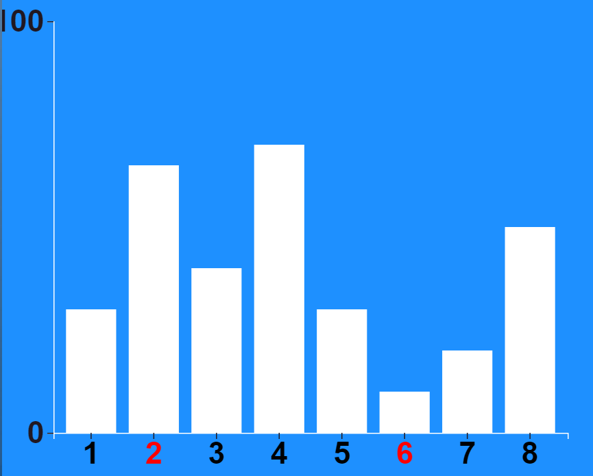
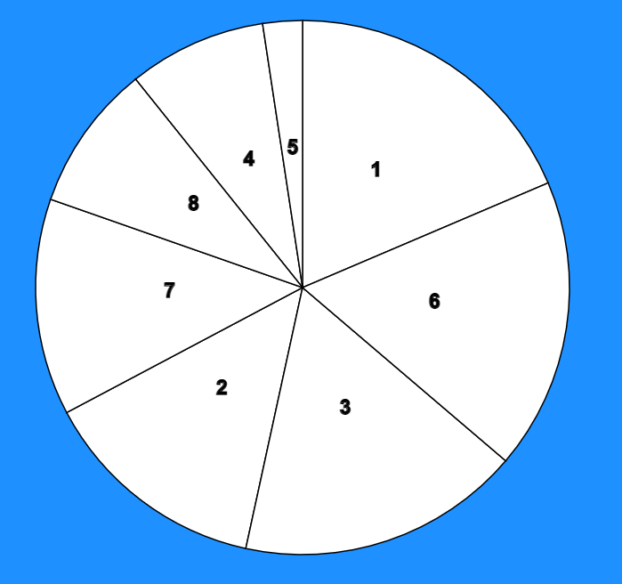
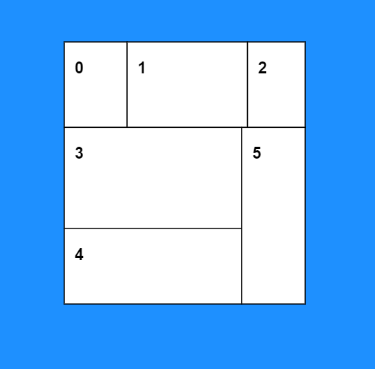
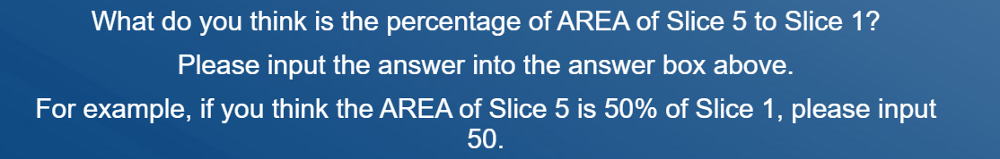
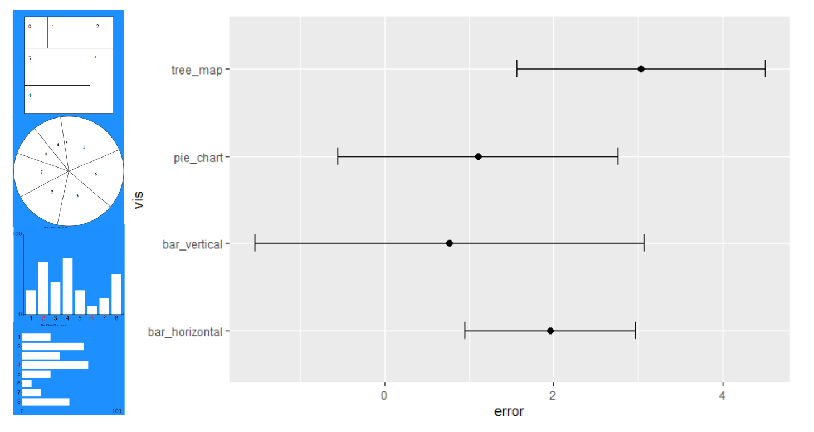

Assignment 3 - Replicating a Classic Experiment  
===

GitHub Details
---
We used HTML, CSS, JavaScript and d3.js to accomplish this experiment. 
The following are the four visualizations we have: the vertical bar chart, horizontal bar chat, pie chart and tree map. 
Every time the users open the web page, the order of the charts that show up are different. 
For example, user A may see the pages in order of horizontal bar, vertical bar, pie chart and tree map, but user B may 
see the pages in an order of tree map, vertical bar, pie char and horizontal bar, etc.

Horizontal Bar

Vertical Bar

Pie Chart

Tree Map

On pages that have the charts, there are instructions that guided users to have an idea about what they should do and what portions of the graph they are going to compare.

In order to get the results from the users, we use nodemailer in node.js. After a user finishes the experiment and reaches the thank you page, an email with a csv file which records the user's answers will be sent to Xiaowei's email adress. After getting enough results, we reorganize the results into one single csv file for error calculation. The following is the error calculation result:

# Experiment

## Website
Here is the link for the web page being hosted on herokuApp: https://charts-experiment.herokuapp.com/

Please note: If you want to reopen the website and you have already clicked the Agree button, please close the web page and reopen it after you go through all the four charts and reach the thank you page! Don't close the web page and try to reopen it in the middle of the way.

### Hypothesis
- People will most accurately guess the correct ratio between graphical elements when using the vertical bar chart. 

### Conclusion 
- As indicated by the BootStrapped 95% confidence interval, it is clear that the horizontal bar chart is the most 
effective way for people to measure relative size. 

#### Reservations: 
- After looking back on the experiment, one reason these results may have been recorded is because when using the 
horizontal bar chart, the 2 bars in question are adjacent to one another. This may have allowed the participant to compare
the bars against each other. 

## Design Achievements
- Used a background image which has the color really fits with the
color of the div where the charts are in. Makes it comfortable for
users to read the page.
- Used LucidChart to add the four charts near our error analysis
graph so that the analyzers can have a clear sense about what
chart the analysis lines are corresponding to.
- Besides the three visualizations as required, we added another
visualization for the experiment. The bar charts have both a vertical
and a horizontal direction, which can test the users' feeling
about bar charts in a more broad way.

## Technical Achievements
- Used Node.js to create the server.
- Made the email-sending functionality work so that the developers
can receive the responders' answers.
- Deployed the web page on herokuApp.

Reference link: https://www.datanovia.com/en/blog/ggplot-examples-best-reference/#error-bars
